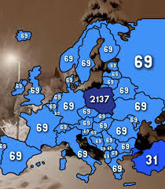

# The blasphemy badge and the 9 layers of hell 

## Layer I: Limbo

Polish hackers are not evil people. Our goal isn't to make fun of religion. 
Our generation was forced to praise the great John Paul II, who singlehandedly
destroyed the communism and saved the church. It was natural, that counterculture
arose around the topic, but this was, belive me, this was something else from the 
very start. That is, AD.2005, 2nd April, 21:37.

I was 10 back then, and don't remember much. The whole nation was so so sad, that
he left us, and my mum (a religious person) was so confused by their reaction. The guy was
sick with parkinson's diesiease, and was barely able to hold the ceremonies he was
obliged to hold.

The internet trolls learned quickly, that mocking the great polish pope was a cheat
code for increadibly effective ragebaiting.

Also, it must be remembered that the pope made an incredibly hurtful decision to
cover up the events of child molesting in churches, supposedly for the greater good 
of the church. The great, "religious" polish citizens liked to pretend this never
happened, which made the trolling even easier, and even kind of justified their
behaviour.

20 years passed since then, the "2137" number is probably the most used PIN number
in Poland, and on cebula.camp, we all sing "barka" (John Paul's favourite song!) each 
day of the event, when 21:37 is on the clock. Not publically, not because we want 
to be assholes. Just because now it's a part of our culture.
So stupid, so blasphemous, so funny.

## Layer II: Lust

Idk I'm horny for validation or sth.

## Layer III: Gluttony

I did not want to make an another "I can't belive it's not an arduino with a display"
badge. Those require some hefty batteries, and [with the recent events](https://why2025.org/post/822),
I felt I've made the proper choice.

I've done a lot of electronics, and felt I'm ready for a next level. So I decided
to use this event to take a deep dive into a cheap, risc-V, low-power BLE MCU.

## Layer VI: Greed

The badge must be programmed with rust. It must not have the on/off switch, those are
for the stupid arduino-badgers. It must handle low power modes well, otherwise the
CR2032 will not be enough for it.

It must be able to play arbitrary waveforms, not just some Nokia-tier buzzing. 

I don't want to include an RTC IC for timekeeping, those are for loosers. The
MCU has its' own RTC. (Actually, nowadays literally any mcu has one) 

I need a way to set the time on the badge. I can use bluetooth for this. Buttons 
and displays are bloat for the damn arduino kids.

I Yolo-ordered the 1st revision, and the speaker amp was not working. It could
never work, this was a wrong IC for the job, but I had noone who could review
my schematic properly.

I decided to remove the USB connector entirely, so the PCB may be simplified
a bit. This means that now, basically noone will be able to update the unholy
abomination of a firmware I managed to write. I thought it'll be just fine when 
I release it.

I ordered 50 PCBs for the second revision.

NEVER EXPECT THE SECOND REVISION TO BE THE FINAL

## Layer V: Wrath

Some people promised to help me, and later did not have time for that. Some people I 
asked for help myself, and then I couldn't really find any task for them, as, due 
to my choices, the project was fucking wild. 

I needed people who knew rust, understood embedded stuff, and had time to deal with
the world of unhinged, semi-abandoned rust HALs.

I had to patch the HAL in many ways, and fight through the dependency hell.

On the second revision, I was hit with JLCPCB's incorrectly creating a schematic
symbol, meaning I now had to somehow patch 50 PCBs. Luckily, the incorrectly marked
pin was a no-connect, so the fix was rather easy, I just had to solder in one capacitor.

## Layer VI: Heresy

"This is fine, I'll just patch a couple of boards, and finish the rest of them and vibecode
the firmware during the event"

Literal heresy, I did the same thing on Chaos Communication Congress, and the firmware was not
"ready" until the middle of day 2.

## Layer VII: Violence

Some device was spamming a weird kind of bluetooth packets, causing the time-setting
webapp to basically become unresponsive. I don't think this was a deliberate troll, but I kind of lost it
back then. I lost it many times, and was ass to some people, sorry for that.

## Layer VIII: Fraud

Arriving at the congress, I had a 3 separate targets working: 

* low power blinky
* PoC audio playback
* Writing mock time to the board via bluetooth (setting the new time actually crashed the board)

So I promised everyone, the firmare is nearly ready, it'll be done today, I said every day for 3 days.

Pumped up with every chemical substance available to me, I pressed onwards, missing half of the events.

## Layer IX: Treachery

The firmware was "ready" day 3, 20 minutes before the dreaded 21:37. I wanted to sell ~30 badges, and managed to 
get to work like 12 of them. The core functionality worked:

* RTC time could be set via an webapp
* The badge was properly entering sleep mode
* The buttons were doing "something"

Our "conference badge" was ready after 80% of the event has passed. This is not how conference badges work.

I've been ensured by many people that this is fine, I don't have to be perfect, it was cool that a couple of badges
actually synchronously played our beloved song.

It kinda was fine, but literally made me loose my mind in the process.

My fault wasn't that I was not good enough, this concept makes no sense. I was 
too greedy with the design, and commited the heresy of "it'll be fine" once again.

I have also played too much ultrakill for the last month (which explains the forced 
dante's inferno format) but this I regret not.

## Layer 0x0A: The future

I've unlocked a shitton of new skills in my tech tree. Revisiting low power and BLE stuff, 
and finally learning CAD design to a point I could realize a dream I had for many years now.

## Layer 0x0B: The buttons

The 3D printed cover contains the buttons. They're not perfect, but sometimes, 
they work really well in my opinion. I've cooperated with a lot of people that knew 
CAD design, and I could never convince them to make the 3D printed buttons I desired.

I don't know if there's any lesson to be learned from that, I'm just happy to scratch
that itch of mine.

## Layer 0x0C: Frens

I could not make the badge finally happen without help of my friends on the congress

I'm especially gratefull to Czaras, Tymek and Łasica for helping with assembling the badges.

Q3k helped me with making the project actually compile'able on other devices, and made the repo structure
suck ass way less.

Yakub, Tymek and Ivan made a rust parser for ".abc" audio format, meaning now I didn't have to deal
with writing that from scratch for the Nokia-tier buzzing feature.

Rib, thanks for bringing me the warm, unfinished can of white red bull, and attempting 
to protect the acetone bottle from being stolen from us (it was).

And many others, so sorry I forgot to mention you by your name.

## Layer 0x0D: xD

Enjoy the links

https://github.com/rough-rat/papajbadge-rs
https://vcc.earth/cts_writer.html

https://en.wikipedia.org/wiki/Death_and_funeral_of_Pope_John_Paul_II
https://en.wikipedia.org/wiki/Inferno_(Dante)
https://ultrakill.fandom.com/wiki/Levels
